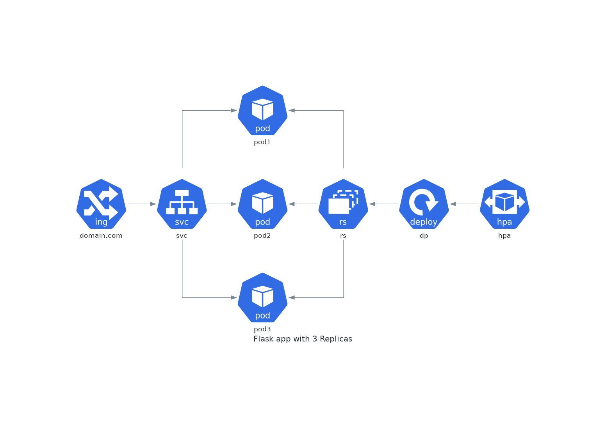

# simple-cloud-native-app
[](https://github.com/atrakic/simple-cloud-native-app/actions/workflows/ci.yml)
[](https://github.com/atrakic/simple-cloud-native-app/actions/workflows/release.yml)

A sample repository with as-simple-as-possible demonstration of running and deploying cloud native (Flask) app on kubernetes.


## Deployment with Github Actions
* Actions used:
  * actions/checkout
  * docker/login-action
  * docker/metadata-action
  * docker/build-push-action
  * azure/k8s-set-context

* Adjust environment variables:
  * [ci](.github/workflows/ci.yml) spins up a throw-away [k3d single cluster](https://github.com/AbsaOSS/k3d-action) 
  * [release](.github/workflows/release.yml)

* To deploy container image on create [github secrets](https://docs.github.com/en/actions/reference/encrypted-secrets):
  * [DOCKERHUB_USERNAME](https://docs.docker.com/docker-id/)
  * [DOCKERHUB_TOKEN](https://docs.docker.com/docker-hub/access-tokens/)

* To deploy with custom [deployment script]() on your k8s cluster create additional github secrets:
  * [KUBE_CONFIG](https://kubernetes.io/docs/concepts/configuration/organize-cluster-access-kubeconfig/)
  * [INGRESS_HOST](https://kubernetes.io/docs/concepts/services-networking/ingress/#name-based-virtual-hosting)

## Demo
- After deployment:

```
$ kubectl -n prod get all
NAME                                READY   STATUS    RESTARTS   AGE
pod/simple-cloud-native-app-7cdbf5f794-cvscr   1/1     Running   0          38m
pod/simple-cloud-native-app-7cdbf5f794-z79m2   1/1     Running   0          38m
pod/simple-cloud-native-app-7cdbf5f794-hv9hn   1/1     Running   0          38m

NAME                   TYPE        CLUSTER-IP      EXTERNAL-IP   PORT(S)   AGE
service/simple-cloud-native-app   ClusterIP   10.43.249.228   <none>        80/TCP    38m

NAME                           READY   UP-TO-DATE   AVAILABLE   AGE
deployment.apps/simple-cloud-native-app   3/3     3            3           38m

NAME                                      DESIRED   CURRENT   READY   AGE
replicaset.apps/simple-cloud-native-app-7cdbf5f794   3         3         3       38m
```

- Run

```
$ curl -sSL http://$INGRESS_HOST
```
